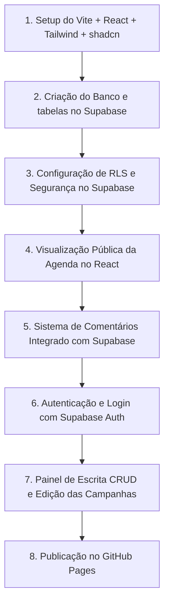

# Planejamento de Stack Técnica e Arquitetura — Agenda de Campanhas

Este documento detalha as decisões técnicas, a arquitetura e as diretrizes de desenvolvimento para o MVP da **Agenda de Campanhas**. Esta versão foi adaptada para usar o **Supabase** como banco de dados e autenticação na nuvem (permitindo escrita colaborativa de múltiplos usuários), hospedando o frontend estático no **GitHub Pages**.

---

## 1. Stack Frontend: Vite + React

Recomendamos o uso de **Vite + React** para o desenvolvimento do frontend do MVP.

### Por que essa escolha se encaixa no PRD e no ambiente do GitHub?
Como o ambiente final de publicação será o **GitHub Pages**, precisamos que a aplicação seja 100% estática (arquivos HTML, CSS e JavaScript rodando direto no navegador). 
O **Vite + React** é a stack ideal. Ele compila o projeto em uma pasta estática chamada `dist` com um clique, facilitando o deploy gratuito no GitHub Pages. Diferente do Next.js padrão, o Vite é leve, inicia em segundos e não exige um servidor Node.js ativo na internet.

### Quais trade-offs (desvantagens/compromissos) estamos aceitando?
* **Lógica no Client-Side (Navegador):** Toda a lógica do aplicativo roda no navegador do visitante. O banco de dados e a autenticação são acessados diretamente pelo código JavaScript client-side através da biblioteca do Supabase.
* **Segurança dependente de políticas de banco:** Como as chaves de conexão ficam expostas no código do navegador, precisamos configurar de forma correta as políticas de segurança do banco (RLS) para evitar que usuários maliciosos acessem dados protegidos.

### Versão recomendada
* **Vite 6.x** com **React 19** e **TypeScript**.

### O que você precisa instalar para usar essa stack?
1. **Node.js** (Versão 18.x ou superior estável).
2. **Visual Studio Code (VS Code)**.
3. **Git**.

---

## 2. Estilização: Tailwind CSS + shadcn/ui

### Tailwind CSS (Estilização Base)
Usaremos o **Tailwind CSS**.
* **Por quê?** Permite estilizar os elementos diretamente nas classes das tags do React (ex: `className="p-4 bg-slate-955 text-white rounded-xl"`). Isso acelera o desenvolvimento, facilita a criação de designs responsivos (celular/desktop) e mantém os estilos limpos.

### shadcn/ui (Componentes Prontos e Acessíveis)
Usaremos a **shadcn/ui** como biblioteca de componentes.
* **Por quê?** Ela insere o código-fonte de modais, calendários e formulários diretamente no seu projeto. Os componentes são bonitos, fáceis de adaptar ao seu design e já trazem todas as diretrizes de acessibilidade (WCAG) programadas.

---

## 3. Backend e Banco de Dados: Supabase

> **O que é Backend?** É o motor que roda no servidor para processar as regras e validar o login. No nosso caso, o Supabase fará o papel de backend na nuvem.
> **O que é Banco de Dados?** É o armário seguro na internet onde os dados (campanhas e comentários) são salvos de forma definitiva.

Recomendamos o **Supabase** como solução de Banco de Dados e Backend.

### Por que essa escolha se encaixa no PRD?
Você precisa que **múltiplos membros da equipe de marketing cadastrem e editem campanhas simultaneamente** de computadores diferentes. O SQLite local não resolve esse cenário, pois os dados ficariam presos na máquina de quem salvou.
Com o Supabase na nuvem:
* Todos os membros autorizados da equipe de marketing podem fazer login e gerenciar as campanhas.
* Roberto (Agência) pode abrir a agenda pública de qualquer lugar e ler as campanhas em tempo real.
* Os comentários do Roberto (usuário externo) e da Mariana (marketing) são salvos de forma integrada na tabela de comentários do Supabase, sem necessidade de sistemas externos como Disqus ou Giscus.

---

## 4. Autenticação: Supabase Auth

> **O que é Autenticação?** É a portaria do sistema: valida o login e a senha dos usuários para permitir que façam alterações.

### Como será aplicada no projeto?
Usaremos o **Supabase Auth** para a tela `/login`. A equipe de marketing fará o login usando seus e-mails corporativos. O Supabase valida as credenciais e fornece um token JWT seguro que o frontend usa para comprovar que o usuário está autenticado e tem permissão para cadastrar, editar ou excluir campanhas.

---

## 5. Pagamentos: Não Aplicável
O MVP é gratuito e para uso pessoal/interno. Ignorar esta seção.

---

## 6. Hospedagem: GitHub Pages (Frontend) + Supabase (Backend/Banco)

* **Hospedagem do Frontend (Páginas do App):** O site estático React compilado será hospedado de forma 100% gratuita no **GitHub Pages**.
* **Hospedagem dos Dados e Login:** O banco de dados PostgreSQL e o gerenciador de autenticação rodam na nuvem do **Supabase** (plano gratuito).
* **Comunicação:** O navegador do visitante acessa as páginas no GitHub Pages e, por debaixo dos panos, o código JavaScript faz chamadas seguras (via HTTPS) para ler/escrever no Supabase.

---

## 7. Bibliotecas Principais

Para fazer essa arquitetura funcionar, usaremos:

1. **`@supabase/supabase-js`** (Cliente Oficial do Supabase)
   * *O que faz:* Biblioteca que conecta o frontend do React à API de banco de dados e autenticação do Supabase.
2. **`react-hook-form`** + **`zod`** (Formulários e Validação)
   * *O que faz:* Controla o preenchimento das telas de cadastro e garante que as datas e dados inseridos estejam corretos antes de enviá-los ao Supabase.
3. **`lucide-react`** (Ícones)
   * *O que faz:* Desenhos modernos para os botões e interfaces.

---

## 8. Estrutura de Pastas Recomendada

```text
agenda-campanhas-parquetec/
├── public/                  # Imagens e logos públicos
├── src/
│   ├── components/          # Componentes reutilizáveis do React
│   │   ├── ui/              # Componentes de interface importados da shadcn/ui
│   │   ├── calendar-view.tsx # Renderiza os calendários mensal/semanal
│   │   ├── list-view.tsx     # Exibe a lista (com abas de ativas e concluídas)
│   │   ├── campaign-modal.tsx # Modal de detalhes que abre ao clicar na campanha
│   │   └── comment-section.tsx # Feed e formulário de comentários do Supabase
│   ├── lib/                 # Conexões e utilitários
│   │   └── supabase.ts      # Inicializa o cliente do Supabase
│   ├── pages/               # Telas principais do aplicativo
│   │   ├── agenda.tsx       # Rota pública do Roberto
│   │   ├── login.tsx        # Tela de login da equipe de marketing
│   │   └── admin-panel.tsx  # Tela de gerenciamento (CRUD) da equipe de marketing
│   └── main.tsx             # Arquivo inicial do React
├── .env.local               # Chaves de acesso ao Supabase (Vite)
└── tailwind.config.js       # Configurações do Tailwind
```

---

## 9. Variáveis de Ambiente (Vite)

As chaves do Supabase devem ser configuradas no arquivo `.env.local` na raiz do projeto. No Vite, variáveis públicas devem ter o prefixo **`VITE_`** para que o React consiga lê-las no navegador.

### Chaves Públicas (Expostas no Navegador)
* **`VITE_SUPABASE_URL`**
  * *O que é:* O link da API do seu projeto no Supabase.
  * *Risco:* Nenhum. Indica apenas a localização do seu banco na nuvem.
* **`VITE_SUPABASE_ANON_KEY`**
  * *O que é:* A chave pública que permite consultas e login básico a partir do frontend.
  * *Risco:* Muito baixo, desde que a RLS (segurança de tabelas) esteja ativada no Supabase.

### Chaves Secretas (NUNCA expor no navegador)
* **`SUPABASE_SERVICE_ROLE_KEY`**
  * *O que é:* Chave mestra de controle total do banco de dados.
  * *Risco:* **Extremamente Crítico. Se essa chave for inserida no front-end com o prefixo `VITE_` ou subir para o GitHub, qualquer pessoa poderá ler ou apagar todos os dados do banco sem login.** Nunca suba este arquivo para o Git.

---

## 10. Riscos Técnicos e Mitigações

1. **Risco: Edição ou exclusão de campanhas por invasores**
   * *O que é:* Como o código do front-end está publicado no GitHub Pages e a chave pública do Supabase está exposta, um usuário malicioso pode tentar enviar dados falsos ou apagar campanhas da API.
   * *Mitigação:* Ativar obrigatoriamente a **RLS (Row Level Security)** nas tabelas `campanhas` e `comentarios` no Supabase:
     * Tabela `campanhas`: Permitir leitura pública (anon), mas limitar a escrita/edição/deleção apenas para usuários autenticados (marketing).
     * Tabela `comentarios`: Permitir leitura pública e inserção pública (para Roberto comentar), mas bloquear edições e deleções para não logados.
2. **Risco: Inconsistência de Datas**
   * *O que é:* Usuários cadastrarem uma campanha onde a data de término ocorre antes da data de início.
   * *Mitigação:* Usar validação com a biblioteca **Zod** no React para impedir que o formulário seja submetido se as datas forem inválidas.
3. **Risco: Excesso de dados no Calendário (Poluição Visual)**
   * *O que é:* Campanhas antigas acumuladas na grade do calendário mensal deixando a visualização confusa e lenta.
   * *Mitigação:* Aplicar o filtro no Supabase para buscar apenas campanhas ativas e futuras na grade mensal. Campanhas concluídas só devem ser consultadas na aba de histórico na lista.

---

## 11. Ordem de Construção Recomendada (Passo a Passo)


